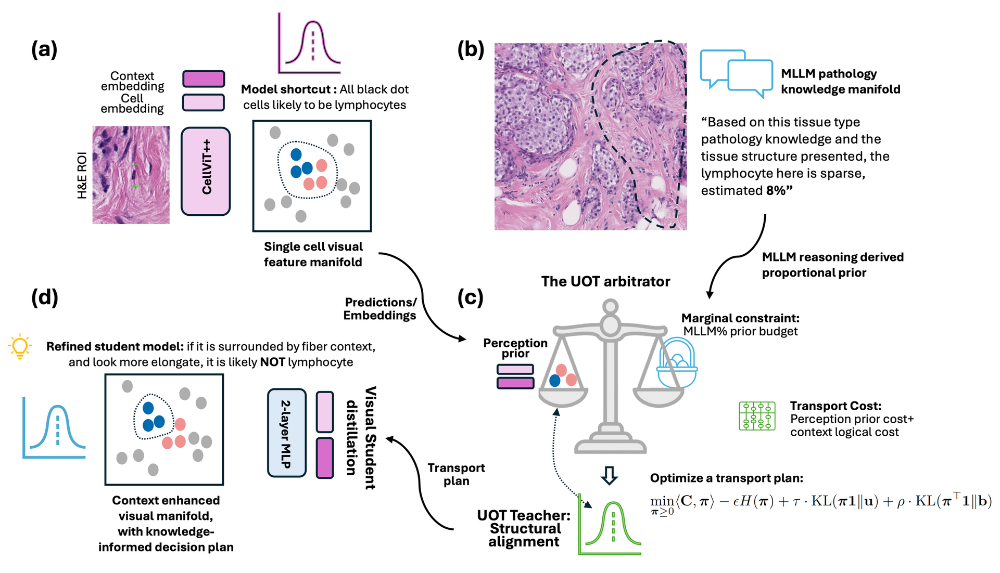

# MLLM Tissue Reasoning Informed Mimicry-Robust Cell Classification via Optimal Transport

Code for *"MLLM Tissue Reasoning Informed Mimicry-Robust Cell
Classification via Optimal Transport"*.

A two-stage cell classification pipeline built on [CellViT++](https://github.com/TIO-IKIM/CellViT-plus-plus):
Stage 1 trains a context-aware classifier directly against region-level MLLM
density estimates; Stage 2 refines predictions at the cell level by
distilling per-cell teacher labels built via unbalanced optimal transport.



**Fig. 1.** Loki-OT pipeline. (a) CellViT++ extracts per-cell morphological and
context embeddings. (b) An MLLM provides tissue-level lymphocyte density
priors. (c) The UOT arbiter balances perceptual evidence against biological
priors to produce soft teacher labels. (d) A lightweight MLP is distilled via
a two-stage curriculum. At inference, only the distilled MLP runs — no MLLM
or OT computation required.

Mapped to this repo's two stages: (a)+(b) feed Stage 1
(`train_stage1_context.py`), which trains directly on the MLLM prior; (c) is
built by `build_uot_teacher.py`, whose cost matrix uses the raw Lizard
baseline's predictions as "perceptual evidence"; (d) is Stage 2
(`train_stage2_distill.py`), which distills those UOT teacher labels into the
final deployed model.

---

## Repository Structure

```
loki_ot_code/
├── src/
│   ├── train_stage1_context.py
│   ├── build_uot_teacher.py
│   ├── train_stage2_distill.py
│   ├── extract_tcga_embeddings.py
│   ├── classify_tcga.py
│   ├── export_predictions.py
│   └── visualize/
│       ├── gradcam.py
│       └── tsne.py
│
├── eval/
│   ├── aggregate_tcga_predictions.py
│   └── compute_metrics.py
│
├── checkpoints/
│   ├── context_soft_v4_epoch018.pth
│   └── loki_ot_v15_epoch003.pth
│
├── data/
│   └── mllm_reference.json
│
├── docs/
│   └── eval_tables_summary.md
│
├── cellvit_repo/
│   └── checkpoints/classifier/sam-h/
│       ├── lizard.pth
│       └── panoptils.pth
├── weights/
│   └── sam_h/
│       └── CellViT-SAM-H-x40-AMP.pth
└── outputs/
    ├── tcga_classification/
    └── eval_tables/
```

| Path | Description |
|---|---|
| `src/train_stage1_context.py` | Stage 1: extract cell+context ViT embeddings, train context-aware classifier |
| `src/build_uot_teacher.py` | Stage 2: build per-cell teacher labels via unbalanced optimal transport |
| `src/train_stage2_distill.py` | Stage 2: distill the final classifier against the OT teacher |
| `src/extract_tcga_embeddings.py` | Extract cell+context embeddings from TCGA whole-slide images |
| `src/classify_tcga.py` | Run all classifiers on TCGA embeddings, export per-ROI JSON predictions |
| `src/export_predictions.py` | Export final per-cell predictions for the training-set ROIs |
| `src/visualize/gradcam.py` | Token-space Grad-CAM: Stage 1 vs Stage 2 comparison |
| `src/visualize/tsne.py` | t-SNE of post-classifier hidden features |
| `eval/aggregate_tcga_predictions.py` | Aggregate classify_tcga.py's per-ROI JSON against TIGER GT -> summary CSVs |
| `eval/compute_metrics.py` | Tables 1-4: MAE, pooled F1/Precision/Recall/AUC/AP, Wilcoxon+Holm, bootstrap CIs |
| `checkpoints/context_soft_v4_epoch018.pth` | Stage 1 checkpoint |
| `checkpoints/loki_ot_v15_epoch003.pth` | Stage 2 / final model checkpoint |
| `data/mllm_reference.json` | MLLM-derived weak-supervision labels |
| `docs/eval_tables_summary.md` | Generated by compute_metrics.py — full table dump |
| `cellvit_repo/` | CellViT++ — cloned via Setup step 1 below, not included in this repo |
| `cellvit_repo/checkpoints/classifier/sam-h/lizard.pth` | Baseline classifier (Lizard) — bundled with the CellViT++ clone, loaded directly by `classify_tcga.py` |
| `cellvit_repo/checkpoints/classifier/sam-h/panoptils.pth` | Baseline classifier (PanopTILs) — bundled with the CellViT++ clone, loaded directly by `classify_tcga.py` |
| `weights/` | Foundation-model backbones — downloaded via Setup, not included |
| `weights/sam_h/CellViT-SAM-H-x40-AMP.pth` | The backbone actually used — loaded by `train_stage1_context.py` and `extract_tcga_embeddings.py`. (`weights/virchow/`, `weights/hipt256/` also download via Setup but aren't used by any script here.) |
| `outputs/` | Created at runtime: caches, per-epoch checkpoints, figures |
| `outputs/tcga_classification/` | aggregate_tcga_predictions.py output (consumed by compute_metrics.py) |
| `outputs/eval_tables/` | compute_metrics.py's CSV outputs (Tables 1-4 source data) |

Run order: `train_stage1_context.py` → `build_uot_teacher.py` →
`train_stage2_distill.py` produces the checkpoints already included above;
`extract_tcga_embeddings.py` → `classify_tcga.py` → `aggregate_tcga_predictions.py`
→ `compute_metrics.py` applies them to TCGA data and reproduces the paper's tables.

---

## Dataset

The raw data paths in this repo's scripts (`.../wsirois/roi-level-annotations/...`,
`.../wsirois/wsi-level-annotations/...`) follow the **TIGER challenge**'s dataset folder naming.

- Challenge page: https://tiger.grand-challenge.org/


**Raw TIGER data** (from the WSIROIS download above) — place directly:
- `images/`, `masks/` — ROI images + tissue region masks
- `wsi-level-annotations/images/` — WSIs
- `wsi-level-annotations/annotations-tissue-cells-xmls/` — GT lymphocyte/cell annotations

**Derived from the raw data by this pipeline** — not part of the TIGER download:
- `selected_images/` — the curated TCGA-BRCA held-out subset. **Placeholder:**
  the selection script isn't in this repo yet.
- `selected_tcga_stardist_mat/` — nuclei instance segmentation on that subset,
  via standard [Stardist](https://github.com/stardist/stardist) (no custom
  code — any standard Stardist run over the selected ROIs produces this).
- `selected_images_output/` — fully generated by this repo's own scripts
  (embeddings cache, classifier JSON/overlay outputs, eval tables).

Place the raw + derived folders under whatever root you set `LOKI_OT_DATA_ROOT`
to (see Setup below).

---

## Setup

### 0. Point at your own data

Every script in `src/` and `eval/` reads raw TIGER data through one shared
environment variable:

```bash
export LOKI_OT_DATA_ROOT=/path/to/your/wsirois
```

If unset, it defaults to this machine's own path
(`/DataMount/xl260/wsirois`) — set it before running anything if you're not
on this machine. See the Dataset section above for what needs to live there.

### 1. Clone CellViT++

CellViT++ is **not vendored** in this repo — it's an external dependency,
cloned fresh into `cellvit_repo/` (already listed in `.gitignore`):

```bash
git clone https://github.com/TIO-IKIM/CellViT-plus-plus.git cellvit_repo
```

### 2. Create the conda environment

```bash
conda create -n loki_ot_env python=3.10 -y
conda env update -n loki_ot_env -f cellvit_repo/environment_verbose.yaml
```

### 3. Install CellViT++'s Python dependencies

```bash
conda activate loki_ot_env
pip install -r cellvit_repo/requirements.txt
```

### 4. Install PyTorch

Pick the index URL for your own GPU/CUDA setup from
https://pytorch.org/get-started/locally/. This repo was built and tested with
torch==2.9.0+cu128 (RTX PRO 6000, Blackwell);

```bash
pip install torch==2.9.0 torchvision==0.24.0 torchaudio==2.9.0 --index-url https://download.pytorch.org/whl/cu128
```

### 5. Verify

```bash
python -c "import torch; print(torch.__version__, torch.cuda.is_available())"
```

